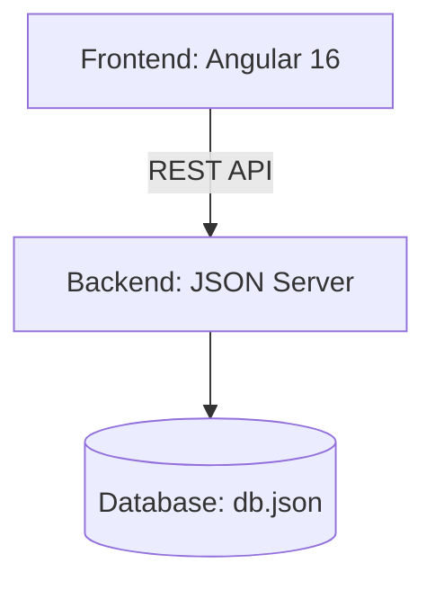

# 🧬 BioStock Manager – Inventory Management System for Laboratories

## 📌 Objectives

### 🎯 General Objective
Develop a web application for efficient inventory management in biological laboratories, combining technical functionality with a user-friendly interface inspired by scientific environments.

### 📍 Specific Objectives
- Digitize the control of reagents, equipment, and laboratory materials.
- Automate low-stock alerts (<20 units) with visual notifications.
- Optimize internal order management and transactions.
- Visualize key data (by categories, location) using charts.
- Ensure cross-platform accessibility (responsive web app).

## 🔍 Justification
In biological research environments, **34% of technical time is lost** due to:
- Manual search for reagents
- Outdated spreadsheet-based inventory systems
- Human errors in stock records

**BioStock Manager** was created to:
- Reduce manual management time by 50%.
- Prevent financial losses due to unnoticed reagent expiration.
- Centralize critical information for multidisciplinary teams.

## ⚠️ Current Issues

| Problem                        | Consequence                                  |
|-------------------------------|----------------------------------------------|
| Excel/paper records           | Outdated and non-collaborative data          |
| Manual alerting               | Critical stock detected too late             |
| Inconsistent categorization   | Difficulty locating materials                |
| No movement history           | Impossible to track consumption              |

## 🛠️ Technical Overview

### Architecture



### Key Technologies
**Frontend**:
- Angular 16 (Standalone Components)
- Angular Material
- Chart.js

**Backend**:
- JSON Server (mock API)
- Node.js (for future scalability)

**Styling**:
- SCSS with CSS3 variables
- Responsive design (Flexbox/Grid)

## 🎨 Scientific Design

```typescript
// Color theme
const theme = {
  primary: '#40E0D0',   // Turquoise (primary actions)
  secondary: '#9370DB', // Purple (categories)
  accent: '#1E90FF',    // Blue (notifications)
  danger: '#FF6B6B'     // Red (alerts)
}
```

### UX Elements

#### 🔬 Scientific iconography
- 🧪 Reagents
- 🧫 Materials
- 🥼 Equipment

#### 🌀 Animated loader
Simulates a centrifuge (CSS animation)

#### ⚛️ Subtle background
Molecular SVG pattern at 5% opacity

## 🚀 Installation

```bash
# 1. Clone the repository
git clone https://github.com/your-username/biostock-manager.git

# 2. Install dependencies
npm install

# 3. Start the mock server (db.json)
npm run start:server

# 4. Start the Angular application
npm start
```

## 🌐 Deployment

This application is configured for deployment to a Node.js hosting service like Render, Glitch, or Cyclic.

1.  **Set Production API URL**: Before deploying, you need to set the `apiUrl` in `src/environments/environment.prod.ts`. Replace the empty string with the URL of your deployed backend.

    ```typescript
    // src/environments/environment.prod.ts
    export const environment = {
      production: true,
      apiUrl: 'https://your-production-api-url.com' // 👈 Add your URL here
    };
    ```

2.  **Deployment Commands**: The hosting service should use the following commands:
    *   **Build Command**: `npm install`
    *   **Start Command**: `npm run start:prod`

    The `postinstall` script in `package.json` will automatically build the Angular application after the dependencies are installed. The `start:prod` script will start the production server.

## 📜 License & Credits
**MIT License**
© 2023 [Dulce Ramírez](https://github.com/Dulceramr) | Grupo Romeu Technical Assessment

*Free for academic and non-profit institutions with attribution.*

---

*"From biologists, for biologists: Manage your reagents with the same precision as your experimental data."* 🧬🔬

*Developed with scientific rigor for Grupo Romeu's technical evaluation.*
